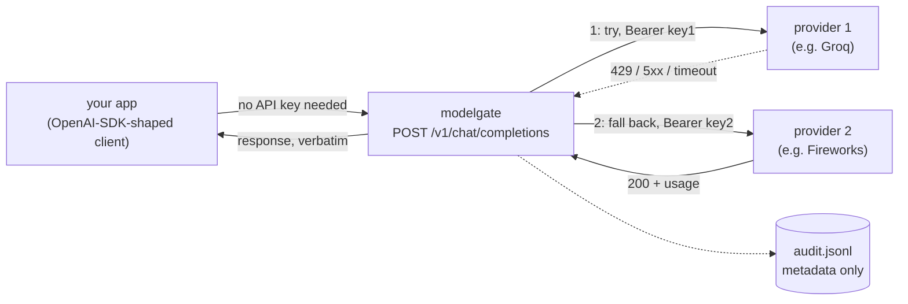

# modelgate

A minimal gateway for OpenAI-compatible `/v1/chat/completions` requests:
point your existing OpenAI-SDK-shaped client at modelgate instead of a
single provider, and it routes to a configured list of backends with
automatic fallback, per-request cost estimation, and a metadata-only
audit trail. Single binary, stdlib-only Go, zero runtime dependencies.

## Why

Most "AI infrastructure" tooling analyzes requests *after the fact* -
logs, traces, evals. modelgate sits *in* the request path instead: your
app's chat-completion calls go through it, so a provider outage or rate
limit becomes an automatic retry against the next configured backend
instead of a 503 your app has to handle, and every call gets a real
dollar cost attached without your app needing to compute it.

- **Fallback, not just retry.** A 429 or 5xx from provider 1 tries
  provider 2, in the order you configure them - not a single provider
  retried harder.
- **Cost accounting from real usage, not estimates.** Reads
  `usage.prompt_tokens`/`completion_tokens` from the actual response and
  multiplies by the pricing you configure per provider.
- **Centralizes API keys.** Your app talks to modelgate with no
  credentials; modelgate injects the right `Authorization: Bearer <key>`
  per provider from its own environment.
- **Audits metadata, never content.** Provider, model, token counts,
  cost, latency, which providers were tried - never the prompt or the
  completion text. See "Privacy stance" below.

## How it works



## Quickstart

```sh
go build -o modelgate ./cmd/modelgate

export GROQ_API_KEY=...
export FIREWORKS_API_KEY=...
./modelgate --config example.config.json --check   # validate config, don't start
./modelgate --config example.config.json
```

```sh
curl http://127.0.0.1:8090/v1/chat/completions \
  -H "Content-Type: application/json" \
  -d '{"model": "any-name-you-like", "messages": [{"role": "user", "content": "hi"}]}'
```

`example.config.json` uses two real providers as a worked example - Groq
(`llama-3.1-8b-instant`, $0.05/$0.08 per 1M prompt/completion tokens) as
primary, Fireworks AI (`gpt-oss-120b`, $0.15/$0.60 per 1M) as fallback -
prices as published on each provider's pricing page, July 2026; check
current pricing before relying on the numbers in cost accounting.

## Config

```json
{
  "listen": "127.0.0.1:8090",
  "audit": { "path": "audit.jsonl" },
  "timeout_seconds": 30,
  "providers": [
    {
      "name": "groq",
      "base_url": "https://api.groq.com/openai/v1",
      "api_key_env": "GROQ_API_KEY",
      "pricing": { "prompt_per_1m_usd": 0.05, "completion_per_1m_usd": 0.08 },
      "model_override": "llama-3.1-8b-instant"
    }
  ]
}
```

- **`providers`** are tried in array order - that order *is* the
  fallback chain.
- **`api_key_env`** names an environment variable modelgate reads once at
  startup (`--check` fails loudly if it's unset - not on the first
  proxied request).
- **`model_override`**, if set, rewrites the request's `"model"` field
  before forwarding to that provider - lets a client send one generic
  model name while each provider serves it under its own naming scheme
  (compare `llama-3.1-8b-instant` on Groq vs
  `accounts/fireworks/models/gpt-oss-120b` on Fireworks for a
  differently-sized model, in the example config above).
- Unknown JSON fields are rejected at load time (a typo'd key fails
  `--check`, not a silent no-op).

## Fallback behavior

| Upstream response | modelgate does |
|---|---|
| `200` | Return it to the client verbatim, log usage + cost, stop. |
| `429` (rate limited) | Log the failed attempt, try the next provider. |
| `5xx` (server error / overloaded) | Log the failed attempt, try the next provider. |
| any other `4xx` (e.g. `400` bad request, `401` bad key) | Forward it to the client immediately - it's about the request, not the backend, so every provider would fail identically. |
| network error / timeout | Log the failed attempt, try the next provider. |
| every provider exhausted | `502` with `attempted_providers` and `last_failure` - not just the last provider's raw response, which would hide that fallback was attempted at all. |

`429`/`5xx`-as-retryable and `200`'s `usage` field name match what Groq,
Together AI, and Fireworks AI (verified against their current docs) all
publish for their OpenAI-compatible endpoints - the same conventions
should hold for most other OpenAI-compatible providers.

## Privacy stance

The audit log (`audit.jsonl`, created `0600`) never contains prompt or
completion text - only provider name, model, HTTP status, token counts,
estimated cost, duration, and which providers were attempted. A sink
failure (disk full, permissions) is counted, not fatal - modelgate keeps
proxying requests even if the audit log breaks.

## Honest limitations (v0.1)

- **No streaming.** A request with `"stream": true` gets a `400`, not
  silently-broken behavior. OpenAI-compatible providers omit `usage` by
  default on streamed responses unless the client sets
  `stream_options.include_usage`, support for which is inconsistent
  across providers - correctly handling both the SSE passthrough and the
  usage extraction is real scope, tracked as a roadmap item, not silently
  faked here.
- **No response caching.** Every request reaches a real provider. A cache
  would need to store request/response content (unlike the audit log,
  which deliberately doesn't), which is a real privacy tradeoff that
  deserves its own opt-in design, not a rushed v0.1 feature.
- **`/v1/chat/completions` only.** No `/v1/completions` (legacy), no
  `/v1/embeddings`, no `/v1/responses`.
- **No per-key rate limiting of *your* clients** (unlike
  [mcp-gateway-lite](https://github.com/bharat3645/mcp-gateway-lite),
  which does this for MCP tool calls) - modelgate's job is fanning out to
  upstream providers, not gating callers.
- Retry/fallback is not a full circuit breaker: a provider that's down
  gets retried on every request, not temporarily skipped after repeated
  failures. Roadmap item.

## Roadmap

- Streaming (SSE passthrough with `stream_options.include_usage` support
  where the provider allows it)
- Circuit breaking: skip a provider that's failed recently instead of
  retrying it every request
- Opt-in response caching with an explicit TTL and content-storage tradeoff documented
- `/v1/embeddings` support

## Development

```sh
go build ./...
go test ./... -race
GW_BIN=./modelgate bash ci/smoke.sh   # real binary + real stub upstreams + audit assertions
```

## Related projects by the same author

[`mcp-gateway-lite`](https://github.com/bharat3645/mcp-gateway-lite) - the
sibling project this one's architecture is modeled on, but gating MCP
tool calls to *your* server instead of routing LLM chat-completion calls
to upstream providers. [`agent-rules-audit`](https://github.com/bharat3645/agent-rules-audit) |
[`mcp-sentinel`](https://github.com/bharat3645/mcp-sentinel) |
[`toolcage`](https://github.com/bharat3645/toolcage) |
[`agent-flightbox`](https://github.com/bharat3645/agent-flightbox)

## License

MIT
